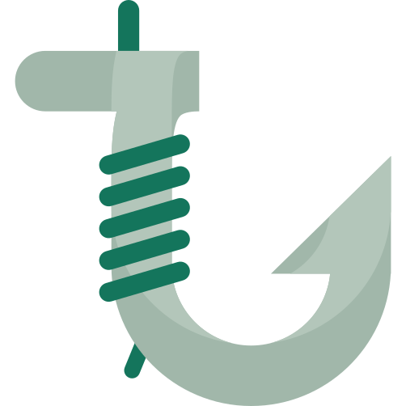

<div align="center">
    
    <div>
        
        
        
    </div>
</div>

# Norminette Hook

The Norminette pre-commit hook.

## ❓ About

Git hooks are actions triggered whenever you do a commit.

The **norminette-hook** will automatically trigger Norminette when you commit, and if you are off the norm it will display what needs to be fixed before you can record this commit to your git history.

This ensures that every commit you do will follow the rules, and you don't have to run Norminette manually anymore.

## 📝 Requirements

- [Pre-commit](https://pre-commit.com/index.html) must be installed system-wide or in a virtual environment.

## 💿 Usage

Create a `.pre-commit-config.yaml` file in the root of your repository.

Add there the following lines:

```yaml
default_language_version:
  python: python3

repos:
  - repo: https://github.com/vcwild/norminette-hook
    rev: v0.1.1
    hooks:
    - id: norminette-hook
```

When executing `pre-commit run` or `pre-commit run norminette-hook`, the hook will be triggered.

Now install the hook to execute it automatically for each commit.

```bash
pre-commit install --install-hooks --overwrite
```

You are now ready for some next level linting automation! 👨‍🚀🚀

## 🤝 Contributing

Fork the repository and create a pull request.

## 🏷️ License

The project is under the [MIT License](https://opensource.org/licenses/MIT). The software is provided as is, without warranty of any kind.
